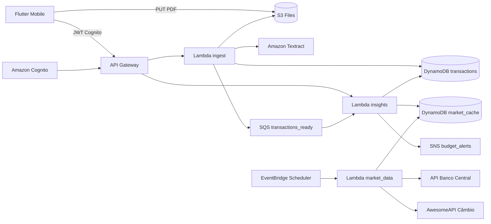

# Arquitetura

O FinanceView usa arquitetura mobile + backend serverless:

- **Flutter** para interface mobile.
- **API Gateway** como entrada HTTP.
- **Cognito** para autenticação.
- **Lambda ingest** para upload, extração, normalização e categorização.
- **Lambda insights** para cálculo financeiro, metas e transações.
- **Lambda market_data** para consultar APIs externas e atualizar cache.
- **DynamoDB** para transações, metas, memória de categorias e cache de mercado.
- **S3** para armazenar arquivos importados.
- **Textract** para OCR de PDFs sem texto extraível.
- **SQS** para acionar recálculo de insights após importação.
- **SNS** para alertas de orçamento no backend.
- **Notificações locais** no Flutter para alertas no dispositivo.

## Diagrama de componentes

## Camadas

### Mobile

- `core`: roteamento, configuração e cliente HTTP.
- `features`: telas por domínio funcional.
- `shared`: widgets, serviços reutilizáveis e utilitários.

### Backend

- `ingest`: ingestão e categorização.
- `insights`: indicadores financeiros, metas e listagens.
- `market_data`: integração com APIs externas de mercado.

### Infraestrutura

- `infra`: Terraform raiz.
- `infra/modules`: módulos AWS por responsabilidade.

## Decisões arquiteturais

- A categorização local fica no backend de ingestão para garantir o mesmo comportamento em preview e importação assíncrona.
- O app permite edição manual antes de confirmar transações.
- A memória de categorias é persistida no DynamoDB com chaves `CATEGORY_MEMORY#...`.
- O cofrinho é tratado no backend de insights para corrigir também dados antigos já persistidos.
- O mobile consome dados agregados do backend, evitando recalcular regras financeiras na interface.
