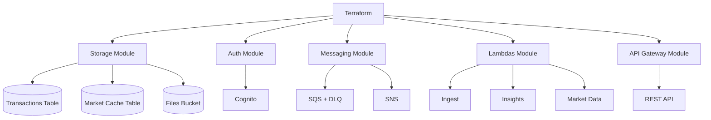

# Infraestrutura

A infraestrutura está em `infra/` e é provisionada com Terraform.

## Estrutura

```text
infra/
├── main.tf
├── variables.tf
├── outputs.tf
├── versions.tf
└── modules/
    ├── api_gateway/
    ├── auth/
    ├── lambdas/
    ├── messaging/
    └── storage/
```

## Módulos

### `storage`

Cria:

- tabela DynamoDB de transações;
- tabela DynamoDB de cache de mercado;
- bucket S3 para arquivos PDF.

### `auth`

Cria:

- Amazon Cognito User Pool;
- cliente Cognito para o app Flutter.

### `messaging`

Cria:

- fila SQS `transactions_ready`;
- DLQ;
- tópico SNS para alertas de orçamento.

### `lambdas`

Cria:

- Lambda `market_data`;
- Lambda `ingest`;
- Lambda `insights`;
- roles IAM;
- policies IAM;
- CloudWatch Log Groups;
- EventBridge Scheduler para atualizar dados de mercado;
- mapeamento SQS para insights.

### `api_gateway`

Cria:

- REST API;
- authorizer Cognito;
- recursos e métodos;
- integrações com Lambda;
- CORS;
- stage por ambiente.

## Variáveis principais

Arquivo: `infra/variables.tf`

| Variável | Finalidade |
|---|---|
| `aws_region` | Região AWS |
| `project_name` | Prefixo dos recursos |
| `environment` | Ambiente: `dev`, `hom` ou `prod` |

Valores específicos de ambiente podem ser definidos em `terraform.tfvars`, mas esse arquivo não deve ser exposto na documentação nem em commits públicos.

## Outputs

Arquivo: `infra/outputs.tf`

Outputs usados para configurar o app e operar o backend:

- nome das tabelas DynamoDB;
- nome do bucket S3;
- Cognito User Pool ID;
- Cognito Client ID;
- nomes das Lambdas;
- URL base da API.

## Permissões IAM relevantes

### Lambda ingest

Precisa de:

- CloudWatch Logs;
- S3 `GetObject` e `PutObject`;
- DynamoDB `Query`, `PutItem`, `UpdateItem`, `BatchWriteItem`;
- SQS `SendMessage`;
- Textract;
- `lambda:InvokeFunction` para reinvocar OCR assíncrono.

### Lambda insights

Precisa de:

- CloudWatch Logs;
- DynamoDB `Query`, `GetItem`, `PutItem`, `UpdateItem`, `DeleteItem`;
- DynamoDB `GetItem` no cache de mercado;
- SQS receive/delete;
- SNS publish.

### Lambda market_data

Precisa de:

- CloudWatch Logs;
- DynamoDB `PutItem`, `GetItem`, `UpdateItem` no cache de mercado.

## Diagrama de infraestrutura



## Segurança

- Não documentar nem commitar `terraform.tfvars` com valores sensíveis.
- Não expor credenciais AWS.
- Não publicar tokens Cognito.
- Revisar permissões IAM pelo princípio do menor privilégio.
- Evitar hardcode de configuração sensível no app.
